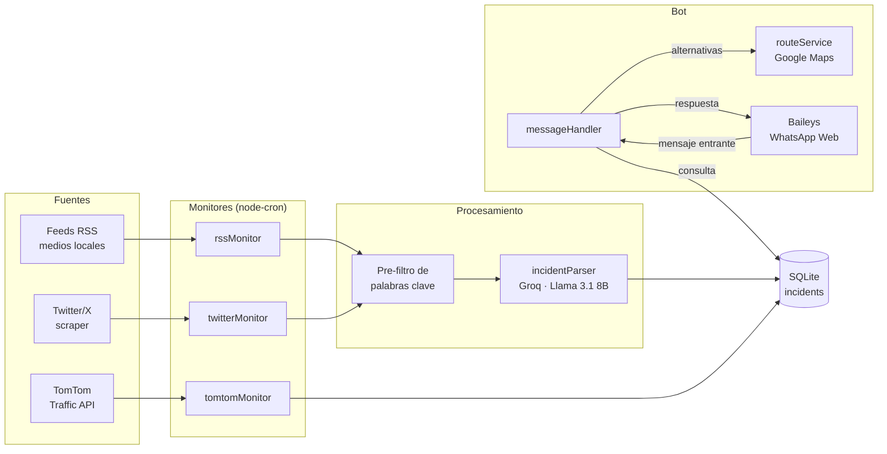

# Bot Vial Huajuapan


Bot de WhatsApp que monitorea en tiempo real el estado vial de **Huajuapan de León, Oaxaca**: accidentes, bloqueos, calles cerradas, retenes, operativos, inundaciones, derrumbes y baches. Agrega información de medios locales, redes sociales y APIs de tráfico, la estructura con un LLM y la sirve por chat con sugerencias de calles alternativas.

## ¿Qué hace?

- **Monitorea 3 tipos de fuentes de forma continua** (tareas programadas con `node-cron`):
  - **RSS de medios locales** — Igavec Noticias, Mixteca Informa, Zona Roja y Oaxaca Vial y Noticias (cada 10–15 min).
  - **Cuentas de Twitter/X** — @Igavec_Noticias, @OaxacaVialSi, @Bloqueos_Oaxaca y @ZonaRoja_Oaxaca vía scraper (cada 20 min, opcional).
  - **TomTom Traffic API** — incidentes de tráfico en un radio de ~15 km alrededor del centro de Huajuapan (cada 10 min, opcional).
- **Extrae incidentes con IA**: cada noticia/tweet pasa primero por un pre-filtro de palabras clave viales (sin costo) y, si es candidato, se envía a **Groq (Llama 3.1 8B Instant)** que devuelve JSON estructurado: tipo, calle, entre calles, severidad y descripción.
- **Deduplica y expira**: los incidentes se guardan en **SQLite** con un hash MD5 de fuente + URL/título como clave única, y expiran automáticamente (TTL configurable, 6 h por defecto).
- **Sugiere rutas alternativas**: con la **Google Maps API** (Geocoding + Directions) obtiene hasta 3 calles alternativas para rodear una vía bloqueada, con caché en memoria de 30 min.
- **Responde por WhatsApp**: conexión vía **Baileys** (WhatsApp Web multi-dispositivo, login por código QR). Contesta a cualquier chat que le escriba; ignora sus propios mensajes y los estados.

## Comandos del bot

| Comando | Descripción |
|---|---|
| `hola` / `menu` / `ayuda` | Muestra el menú de bienvenida |
| `reportes` | Todos los incidentes activos (últimas 6 h) |
| `accidentes` | Solo accidentes y choques |
| `bloqueos` | Bloqueos y calles cerradas |
| `retenes` | Retenes y alcoholímetros |
| `operativos` | Operativos policiales |
| `calle [nombre]` | Busca incidentes en una vía específica |
| `estado` | Resumen estadístico (activos por severidad) |

También entiende frases naturales como *"¿qué está pasando?"*, *"¿cómo está el tráfico?"* o *"voy de... ¿hay algo en mi ruta?"*. Cada reporte incluye emoji por tipo y severidad, la fuente, hace cuánto ocurrió y —si hay API de Google Maps— las calles alternativas sugeridas.

## Arquitectura



**Flujo:** los monitores corren en segundo plano una vez que WhatsApp conecta. TomTom entrega datos ya estructurados y va directo a la base; RSS y Twitter pasan por el pre-filtro barato y luego por el LLM extractor. El manejador de mensajes solo lee de SQLite, por lo que las respuestas son instantáneas.

## Estructura del proyecto

```
wb-vial/
├── src/
│   ├── index.js                 # Punto de entrada: conexión WhatsApp + arranque de monitores
│   ├── config.js                # Feeds, cuentas, keywords, emojis y parámetros
│   ├── bot/
│   │   └── messageHandler.js    # Comandos y flujo conversacional
│   ├── monitors/
│   │   ├── rssMonitor.js        # Feeds RSS de medios locales (cron)
│   │   ├── twitterMonitor.js    # Scraper de cuentas de X (cron)
│   │   └── tomtomMonitor.js     # TomTom Traffic API por bounding box (cron)
│   ├── parsers/
│   │   └── incidentParser.js    # Pre-filtro + extracción JSON con Groq
│   ├── services/
│   │   ├── incidentService.js   # CRUD, deduplicación, expiración y estadísticas
│   │   └── routeService.js      # Calles alternativas (Google Maps) con caché
│   └── database/
│       └── db.js                # SQLite (better-sqlite3, WAL) y esquema
├── auth/                        # 🔒 Credenciales de sesión de WhatsApp (no versionar)
├── data/                        # 🔒 Base de datos SQLite (no versionar)
├── logs/                        # 🔒 Logs de ejecución (no versionar)
├── .env.example                 # Plantilla de variables de entorno
└── package.json
```

## Requisitos

- **Node.js ≥ 18**
- Un número de WhatsApp para vincular el bot (como dispositivo adicional)
- **API key de Groq** (gratuita en [console.groq.com](https://console.groq.com)) — **requerida**
- Opcionales:
  - **TomTom API key** ([developer.tomtom.com](https://developer.tomtom.com), 2,500 req/día gratis)
  - **Google Maps API key** con Geocoding + Directions habilitadas (para calles alternativas)
  - Cuenta secundaria de Twitter/X (para el monitor de tweets)

## Instalación

```bash
git clone https://github.com/B0B1A6AE23/bot-vial-huajuapan.git
cd bot-vial-huajuapan
npm install
```

Configura las variables de entorno:

```bash
cp .env.example .env
```

Edita `.env` con tus claves (usa placeholders como estos, nunca subas el archivo real):

```env
# === REQUERIDO ===
GROQ_API_KEY=gsk_xxxxxxxxxxxxxxxxxxxxxx

# === OPCIONAL: rutas alternativas ===
GOOGLE_MAPS_API_KEY=

# === OPCIONAL: monitor TomTom ===
TOMTOM_API_KEY=

# === OPCIONAL: monitor Twitter/X (cuenta secundaria) ===
TWITTER_USER=
TWITTER_PASS=
TWITTER_EMAIL=

# === CONFIGURACIÓN ===
INCIDENT_TTL_HOURS=6
```

Arranca el bot:

```bash
npm start
```

En el primer arranque se mostrará un **código QR** en la terminal: escanéalo desde WhatsApp → **Dispositivos vinculados**. La sesión queda guardada en `auth/` y las reconexiones son automáticas. Los monitores opcionales se deshabilitan solos si su clave no está definida.

## Scripts npm

| Script | Comando | Descripción |
|---|---|---|
| `npm start` | `node src/index.js` | Ejecuta el bot en producción |
| `npm run dev` | `node --watch src/index.js` | Desarrollo con recarga automática |

## Seguridad

Las carpetas `auth/` (llaves de sesión de WhatsApp), `data/` (base SQLite) y `logs/`, junto con el archivo `.env`, contienen información sensible y **nunca deben versionarse** — ya están excluidas en `.gitignore`.

## Licencia

Código bajo licencia [MIT](LICENSE). Las fuentes de datos de terceros (feeds RSS, TomTom, redes sociales) conservan sus propios términos de uso.

## Autor

**Ángel Josué García Cantero** — [@AngelJGC](https://github.com/AngelJGC)
